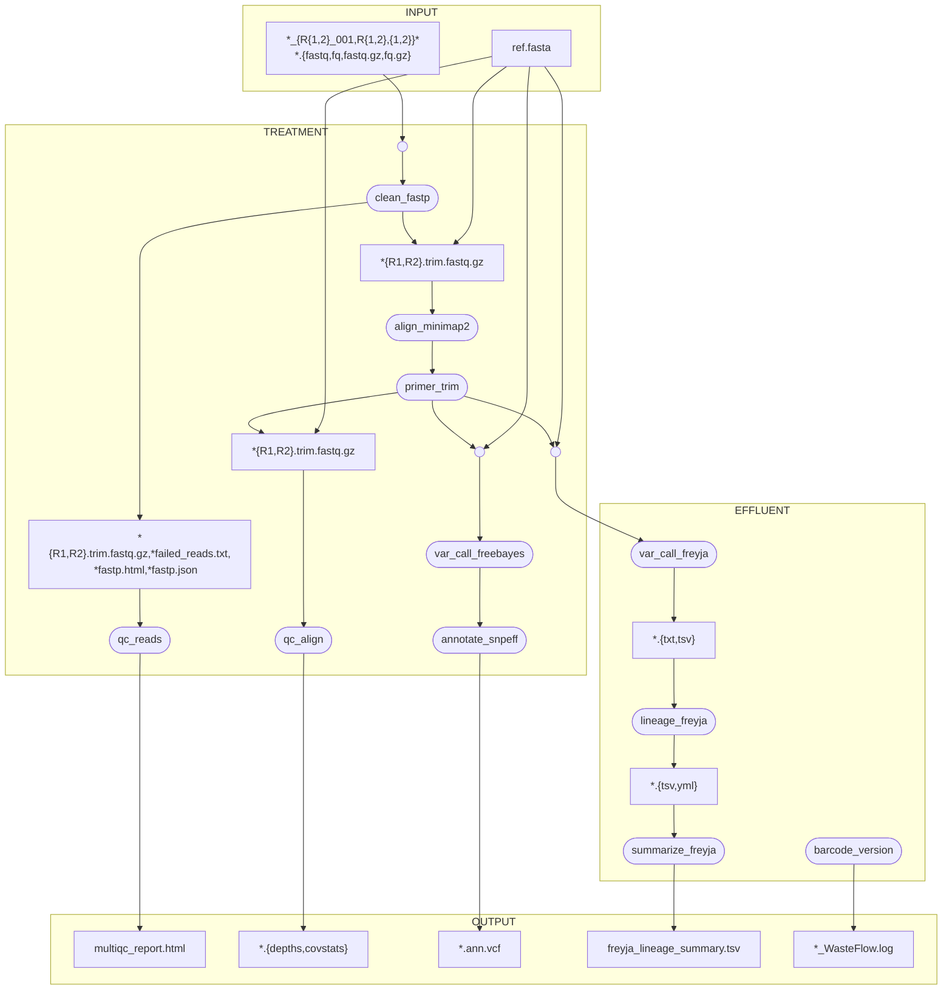
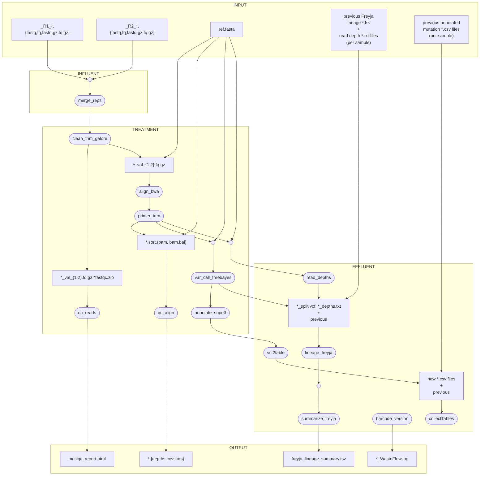
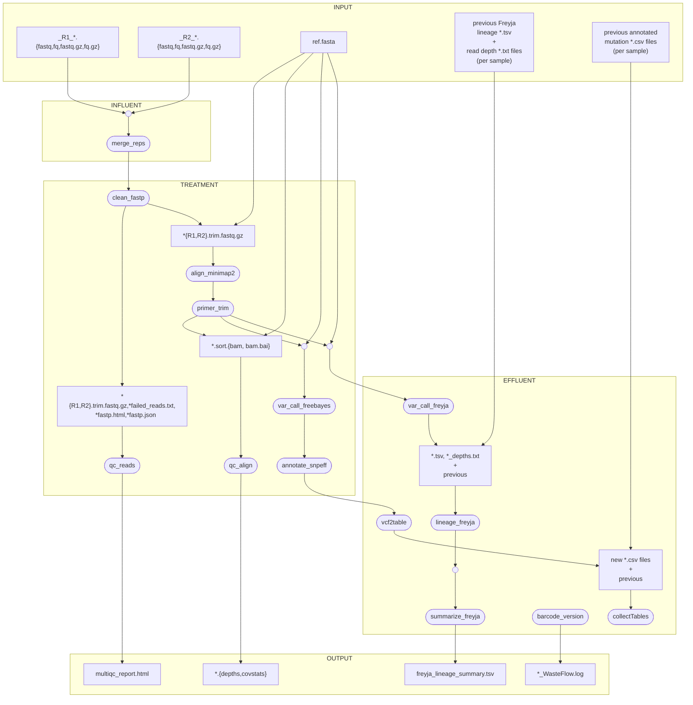

## Introduction

The excretion of pathogens by humans during active infection allows the contemporaneous monitoring of outbreaks in wastewater.
Wastewater includes liquids drained from toilets, showers, and dishwashers. Sewage is treated across 5 wastewater treatment plants in
Metro Vancouver before becoming effluent. Samples are collected prior to treatment from the non-solid fraction, RNA is extracted, and genomic material
is sequenced. This pipeline, WasteFlow, written in Nextflow aims to provide a standardized approach to further resolve presence or absence of SARS-CoV-2 in wastewater, into lineages infecting the population to inform precautionary measures and therapeutic strategies.

## Table of Contents

- [Introduction](#introduction)
- [Quick-Start Guide](#quick-start-guide)
- [Dependencies](#dependencies)
- [Installation](#installation)
- [Input](#input)
- [Output](#output)
- [Parameters](#parameters)
- [Workflow](#workflow)
- [References](#references)

## Quick Start

```
nextflow run BCCDC-PHL/WasteFlow -profile conda --data_dir /path/to/pe/fastq/files/ --ref ./resources/cov2_ref.fasta --primers ./resources/articV5.3.bed
```

## Dependencies

[Conda](https://conda.io/projects/conda/en/latest/user-guide/install/index.html) is required to build an environment with required workflow dependencies.

This bioinformatic pipeline requires [Nextflow](https://www.nextflow.io/):
```
conda install -c bioconda nextflow
```
or download and add the nextflow executable to a location in your user $PATH variable:
```
curl -fsSL get.nextflow.io | bash
mv nextflow ~/bin/
```
Nextflow requires Java v8.0+, so check that it is installed:
```
java -version
```
The OS-independent conda environments activated upon running WasteFlow are specified in the
```envs``` folder of the project directory and is built when 
```-profile conda``` is included in the command line. Nextflow will save
the environment to the ./work/conda directory by default. Alternatively, the 
necessary conda environment can be saved to a different shared location 
accesible to compute nodes by adding ```--conda_cache /path/to/new/location/```.

## Installation

To copy the program into a directory of your choice, from desired directory run:
```
git clone https://github.com/j3551ca/WasteFlow.git
cd WasteFlow
nextflow run main.nf -profile conda --data_dir /path/to/input/data
```

alternatively:
```
nextflow run BCCDC-PHL/WasteFlow -profile conda --data_dir /path/to/pe/fastq/files/ --ref ./resources/cov2_ref.fasta --primers ./resources/articV5.3.bed
```

## Quick-Start Guide

```
# Run all modules from the WasteFlow directory after cloning repository:
nextflow run main.nf -profile conda --data_dir /path/to/input/data

# Run all modules outside of WasteFlow
nextflow run j3551ca/WasteFLow -profile conda --data_dir /path/to/input/data

# Run all modules + collate all *mutation_tables.csv, construct mutation measurements, and write cumulative file
nextflow run main.nf -profile conda --data_dir /path/to/input/data --rerun_mut "/path/to/dir/holding/*mutation_table.csv" --mut_dir /path/to/write/cumlative_file  
```

## Input

The pipeline requires the following files:

| Input       | Option | Description | Notes   |                                                                                             
|:--------------|:------------------------|:------------------------------------|:-----------|
| Reference genome | --ref       | Reference genome of pathogen of interest for guided read alignment | ./resources/cov2_ref.fasta                                                                      |
| Paired-end sequencing reads| --dir        | Paired-end sequencing reads. WasteFlow will accept *.fastq.gz, *.fq.gz, *.fastq, *.fq [./data_dir/*.fq].  | Ensure the absolute path of the directory containing data to be analyzed is used, otherwise MultiQC will throw an error. To merge replicates of the same sample (--combine_reps) the replicate number must be present in the filename as -#- | 
| Bed file | --primers     | Primer scheme bed file  |  ${projectDir}/resources/articV5.3.bed                              |
| Results directory | --out_dir          | Path of directory to output results into |                                       |          

## Output

| Output | Description |  
| :--------------- | :--------------- |
| freyja_lineage_summary.tsv    | File containing Freyja output of relative abundances of pathogen variants in each sample | 
| *vcf.tsv    | Variant Call Format file per sample produced during `freyja variants` command (iVar) | 
| *_depths.txt    | Depth per position files per sample produced during `freyja variants` command (samtools)  |
| multiqc_report.html    | QC of reads and alignments for each sample.  |
| _WasteFlow.log    | Log of runtime information like Freyja barcode used, analysis start-time, directories, command executed.  |

## Parameters

| Parameter | Description | Required | Default |
| :--------------- | :--------------- | :--------------- | :--------------- |
| dir    | User's directory that contains input paired-end sequence reads (fastq files).
WasteFlow accepts gzip compressed or uncompressed files (*.fastq.gz, *.fq.gz, *.fastq, *.fq). Ensure the absolute path of the directory containing data to be analyzed is used, otherwise MultiQC will throw an error. | yes | none |
| ref    | Reference genome used to align reads to during guided assembly | yes | resources/cov2.fa |
| out_dir    | User-specified directory to output WasteFlow results to. | no | data_dir/results |
| combine_reps    |Include this option to combine multiple sequencing replicates into one file containing all forward reads and one file containing all reverse reads. To merge replicates of the same sample, the replicate number must be present in the filename as -#- (ex. prefix-2-suf_fix.fq). | no | off |
| trim_galore    | Include this switch to use trim-galore to trim adapters/ low qual bases | no | fastp |
| bwa    | Include this switch to use bwa-mem to align reads to reference | no | minimap2 |
| conda_cache    | User-defined location to save conda env | no | ./work/conda |
| adapters    | Additional adapters to include during trimming with fastp  | no | ${projectDir}/resources/cov2_adapter.fasta |
| primers    | Bed file containing primer scheme for trimming with iVar | yes | ${projectDir}/resources/articV5.3.bed |
| primerless_reads    | iVar trim include reads that are outside of primer regions/ no primers (ie. Nextera) | no | off |
| primer_pairs    | iVar trim specify path to primer pairs *.tsv file when amplicons are fragmented (ie. Nextera) | no | none |
| skip_trim    | Skip primer trimming (ie. probe-enrichment)  | no | off |
| ivar_flags    | Additional options to pass to iVar during primer/ quality trimming | no | -m 30 -q 20 -s 4 |
| freebayes    | Include this switch to use freebayes to call variants | no | Freyja::iVar |
| freeb_flags    | Additional options to pass freebayes during variant calling | no | -p 1  --pooled-continuous --min-coverage 5 |
| demixdepth    | The minimum read depth for a site to be considered in Freyja demix. Collapses indistinguishable lineages.  | no | 10 |
| boot    | Activate Freyja bootstrap estimates of each lineage (*_lineages.csv) & WHO VOI/VOC (\*_summarized.csv) | no | off |
| bootnum    | Number of bootstrap replicates to perform for lineage abundance estimations | no | 100 |
| rerun_lins    | Search string providing path to previously generated vcf and depth files (ex. "/path/to/*{.txt,.tsv}").
Reruns Freyja demix command which is the lineage classificaion step. Useful for re-analyzing past samples after Freyja barcode has been updated. | no | off |
| rerun_mut    | User-defined pathway/search string used to collect past mutation tables. Must be quoted.  | no | none |
| mut_dir    | User-defined path to save cumulative mutation table | no | none |
| annotate_snps    | This will produce a CSV table of annotated mutations for each sample. Currently variants are called by Freebayes and annotated with SnpEff. NOTE: this behaviour (ie. vcf2table process) is automatically active if you are using --rerun_mut. | no | off |
| dt_threads | Set number of threads used by data.table. This is relevant to the mutation-monitoring processes in R and prevents a segfault error [#1](https://github.com/BCCDC-PHL/WasteFlow/issues/1)  | no | 60 |
| version    | Current WasteFlow version number | no | none |
| help    | Help on usage of WasteFlow | no | none |

## Workflow

WasteFlow was designed to allow multiple workflows for various pathogens. For example, reads can be processed with trim-galore or fastp, alignments can be generated with bwa or minimap2, variants can be called with iVar or Freebayes, and lineage calls made by Freyja can be performed on one directory or multiple. The modularity of Nextflow facilitates the addition of alternate packages. WasteFlow has currently been tested on SARS-CoV-2. Common workflows are outlined below: 

**The default workflow:**

```
nextflow run BCCDC-PHL/WasteFlow -r v2.0.1 --data_dir /mandatory/path/to/ww/fastqs
```


**The alternative workflow:**

```
nextflow run BCCDC-PHL/WasteFlow -r v2.0.1 --data_dir /mandatory/path/to/ww/fastqs/ --out_dir /alternative/results/folder/ --bwa --trim_galore --freebayes --combine_reps --primerless_reads --primer_pairs /path/to/tsv/of/primerPairs.tsv --boot --bootnum 10 --demixdepth 100 --rerun_mut "/path/to/past/mut_tables/*{.csv}" --mut_dir /mandatory/path/to/cumulative/mut_table/output --rerun_lins "/path/to/past/freyja_var/outputs/*{.txt,.tsv}"
``` 

Note the quotation marks around --rerun_mut and --rerun_lins paths.


**BCCDC workflow:**

```
nextflow run BCCDC-PHL/WasteFlow -r v2.0.1 --data_dir /mandatory/path/to/ww/fastqs/ --combine_reps --primerless_reads --primer_pairs /path/to/tsv/of/primerPairs.tsv --rerun_lins "/path/to/past/freyja_var/outputs/*{.txt,.tsv}" --rerun_mut "/path/to/past/annotated_mutation/outputs/*.csv"
--mut_dir /path/to/cumulative/annotated/mutation/table/output
```


## References

1. Karthikeyan, S., Levy, J.I., De Hoff, P. et al. Wastewater sequencing reveals early cryptic SARS-CoV-2 variant transmission. Nature 609, 101–108 (2022). https://doi.org/10.1038/s41586-022-05049-6

2. Heng Li, Minimap2: pairwise alignment for nucleotide sequences, Bioinformatics, Volume 34, Issue 18, September 2018, Pages 3094–3100, https://doi.org/10.1093/bioinformatics/bty191

3. Grubaugh, N.D., Gangavarapu, K., Quick, J. et al. An amplicon-based sequencing framework for accurately measuring intrahost virus diversity using PrimalSeq and iVar. Genome Biol 20, 8 (2019). https://doi.org/10.1186/s13059-018-1618-7

4. Shifu Chen, Yanqing Zhou, Yaru Chen, Jia Gu, fastp: an ultra-fast all-in-one FASTQ preprocessor, Bioinformatics, Volume 34, Issue 17, September 2018, Pages i884–i890, https://doi.org/10.1093/bioinformatics/bty560

5. Heng Li, Bob Handsaker, Alec Wysoker, Tim Fennell, Jue Ruan, Nils Homer, Gabor Marth, Goncalo Abecasis, Richard Durbin, 1000 Genome Project Data Processing Subgroup, The Sequence Alignment/Map format and SAMtools, Bioinformatics, Volume 25, Issue 16, August 2009, Pages 2078–2079, https://doi.org/10.1093/bioinformatics/btp352

6. Garrison E, Marth G. Haplotype-based variant detection from short-read sequencing. arXiv preprint arXiv:1207.3907 [q-bio.GN] 2012

7. A program for annotating and predicting the effects of single nucleotide polymorphisms, SnpEff: SNPs in the genome of Drosophila melanogaster strain w1118; iso-2; iso-3.", Cingolani P, Platts A, Wang le L, Coon M, Nguyen T, Wang L, Land SJ, Lu X, Ruden DM. Fly (Austin). 2012 Apr-Jun;6(2):80-92. PMID: 22728672

8. Using Drosophila melanogaster as a model for genotoxic chemical mutational studies with a new program, SnpSift", Cingolani, P., et. al., Frontiers in Genetics, 3, 2012.

9. Philip Ewels, Måns Magnusson, Sverker Lundin, Max Käller, MultiQC: summarize analysis results for multiple tools and samples in a single report, Bioinformatics, Volume 32, Issue 19, October 2016, Pages 3047–3048, https://doi.org/10.1093/bioinformatics/btw354

10. Andrews, S. (2010). FASTQC. A quality control tool for high throughput sequence data

11. Martin, M. (2011). Cutadapt removes adapter sequences from high-throughput sequencing reads. EMBnet.journal, 17(1), pp. 10-12. doi:https://doi.org/10.14806/ej.17.1.200

