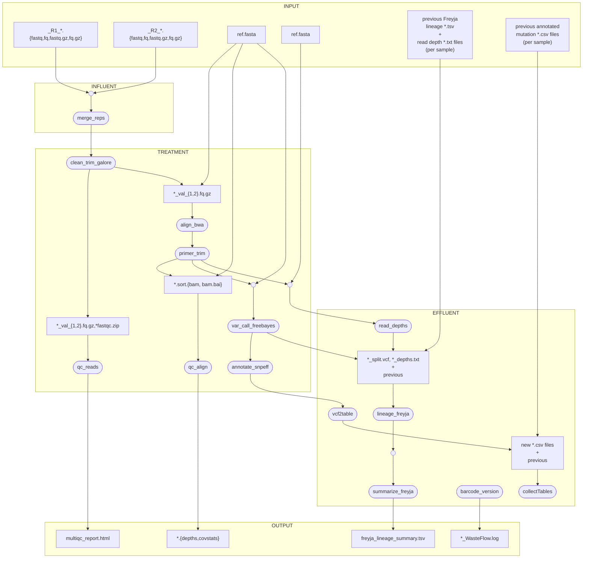
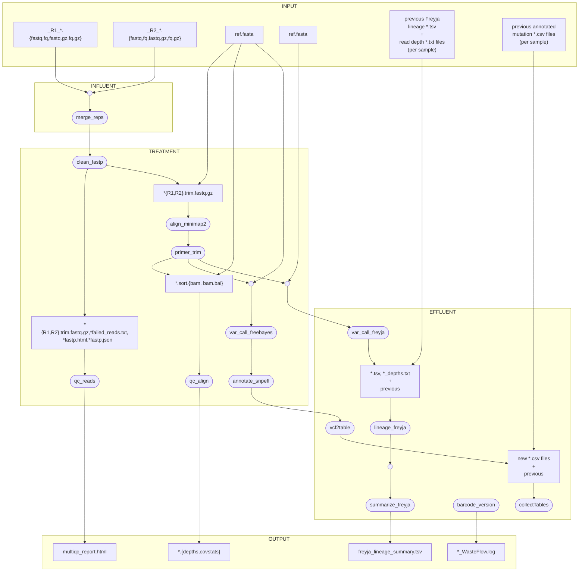

## Introduction

The excretion of pathogens by humans during active infection allows the contemporaneous monitoring of outbreaks in wastewater.
Wastewater includes liquids drained from toilets, showers, and dishwashers. Sewage is treated across 5 wastewater treatment plants in
Metro Vancouver before becoming effluent. Samples are collected prior to treatment from the non-solid fraction, RNA is extracted, and genomic material
is sequenced. This pipeline, WasteFlow, written by JMC in Nextflow aims to provide a standardized approach to further resolve presence or absence of SARS-CoV-2 in wastewater, into lineages infecting the population to inform precautionary measures and therapeutic strategies.

## Table of Contents

- [Introduction](#introduction)
- [Quick-Start Guide](#quick-start%guide)
- [Dependencies](#dependencies)
- [Installation](#installation)
- [Input](#input)
- [Output](#output)
- [Workflow](#workflow)
- [References](#references)

## Quick-Start Guide

```
nextflow run main.nf -profile conda --data_dir /path/to/pe/fastq/files/ --ref ./resources/cov2_ref.fasta --primers ./resources/articV5.3.bed --conda_cache /home/jess.cal/caches/  
```

## Dependencies

[Conda](https://conda.io/projects/conda/en/latest/user-guide/install/index.html) is required to build an environment with required workflow dependencies.

This bioinformatic pipeline requires Nextflow:
```
conda install -c bioconda nextflow
```
or download and add the nextflow executable to a location in your user $PATH variable:
```
curl -fsSL get.nextflow.io | bash
mv nextflow ~/bin/
```
Nextflow requires Java v8.0+, so check that it is installed:
```
java -version
```
The OS-independent conda environment activated upon running WasteFlow is specified in the
```wasteflow_env.yml``` file of the project directory and is built when 
```-profile conda``` is included in the command line. Nextflow will save
the environment to the project directory by default. Alternatively, the 
necessary conda environment can be saved to a different shared location 
accesible to compute nodes by adding ```--conda_cache /path/to/new/location/```.

## Installation

To copy the program into a directory of your choice, from desired directory run:
```
git clone https://github.com/j3551ca/WasteFlow.git
cd WasteFlow
nextflow run main.nf -profile conda --data_dir /path/to/input/data
```

## Quick Start

```
# Run all modules from the WasteFlow directory after cloning repository:
nextflow run main.nf -profile conda --data_dir /path/to/input/data

# Run all modules outside of WasteFlow
nextflow run j3551ca/WasteFLow -profile conda --data_dir /path/to/input/data

# Run all modules + collate all *mutation_tables.csv, construct mutation measurements, and write cumulative file
nextflow run main.nf -profile conda --data_dir /path/to/input/data --table_search_string "/path/to/dir/holding/*mutation_table.csv" --sum_dir /path/to/write/cumlative_file  
```

## Input

The pipeline requires the following files:

- Reference genome for guided read alignment [./data_dir/sequences.fasta]
- Paired-end sequencing reads. WasteFlow will accept *.fastq.gz, *.fq.gz, *.fastq, *.fq [./data_dir/*.fq]. 
Ensure the absolute path of the directory containing data to be analyzed is used, otherwise MultiQC will throw an error.
- Primer scheme bed file [./data_dir/primer[vers].bed]

## Output

## Workflow

WasteFlow was designed to allow multiple workflows for various pathogens. For example, reads can be processed with trim-galore or fastp, alignments can be generated with bwa or minimap2, variants can be called with iVar or Freebayes, and lineage calls made by Freyja can be performed on one directory or multiple. The modularity of Nextflow facilitates the addition of alternate packages. WasteFlow has currently been tested on SARS-CoV-2. Common workflows are outlined below: 

--combine_reps This allows multiple sequencing replicates to be combined into one file containing all forward reads and one file containing all reverse reads. 

--annotate_snps This will produce a table of annotated mutations for each sample. Currently variants are called by Freebayes and annotated with SnpEff. 

--primerless_reads 
--primer_pairs 

**The default workflow:**

```
nextflow run BCCDC-PHL/WasteFlow -r v2.0.1 --data_dir /mandatory/path/to/ww/fastqs
```


**The alternative workflow:**

```
nextflow run BCCDC-PHL/WasteFlow -r v2.0.1 --data_dir /mandatory/path/to/ww/fastqs/ --out_dir /alternative/results/folder/ --bwa --trim_galore --freebayes --combine_reps --primerless_reads --primer_pairs /path/to/tsv/of/primerPairs.tsv --boot --bootnum 10 --demixdepth 100 --rerun_mut "/path/to/past/mut_tables/*{.csv}" --mut_dir /mandatory/path/to/cumulative/mut_table/output --rerun_lins "/path/to/past/freyja_var/outputs/*{.txt,.tsv}"
``` 

Note the quotation marks around --rerun_mut and --rerun_lins paths.


**BCCDC workflow:**

```
nextflow run BCCDC-PHL/WasteFlow -r v2.0.1 --data_dir /mandatory/path/to/ww/fastqs/ --combine_reps --primerless_reads --primer_pairs /path/to/tsv/of/primerPairs.tsv --annotate_snps --rerun_lins "/path/to/past/freyja_var/outputs/*{.txt,.tsv}"
```


## References

